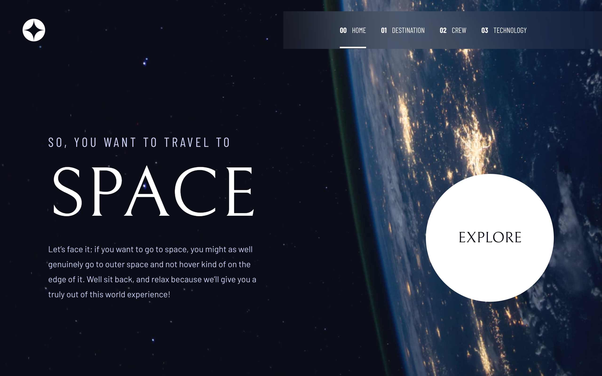
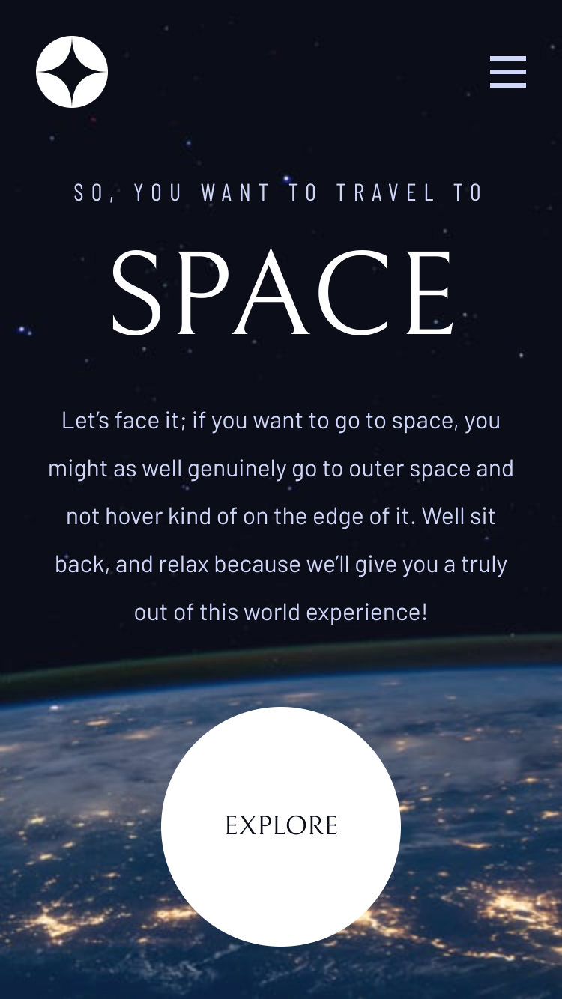
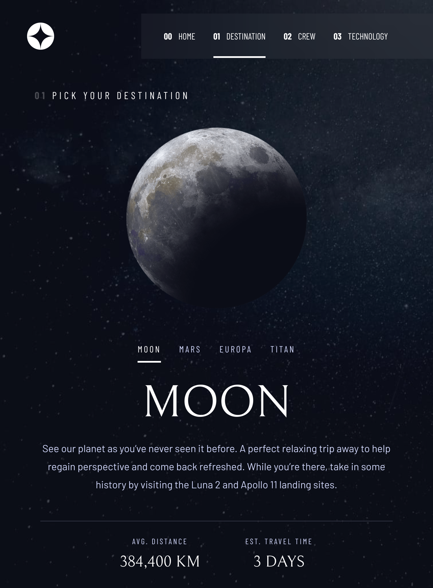
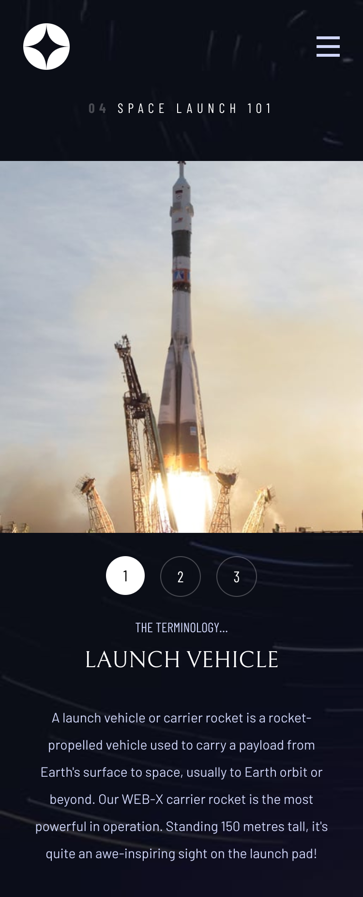

# Frontend Mentor - Space tourism website solution

This is a solution to the [Space tourism website challenge on Frontend Mentor](https://www.frontendmentor.io/challenges/space-tourism-multipage-website-gRWj1URZ3). Frontend Mentor challenges help you improve your coding skills by building realistic projects.

## Table of contents

- [Overview](#overview)
  - [The challenge](#the-challenge)
  - [Screenshot](#screenshot)
  - [Links](#links)
- [My process](#my-process)
  - [Built with](#built-with)
  - [What I learned](#what-i-learned)
- [Author](#author)

## Overview

### The challenge

Users should be able to:

- View the optimal layout for each of the website's pages depending on their device's screen size
- See hover states for all interactive elements on the page
- View each page and be able to toggle between the tabs to see new information

### Screenshot

#### Desktop

#### Mobile

### Links

- Solution URL: [Add solution URL here](https://your-solution-url.com)
- Live Site URL: [Add live site URL here](https://space.raelcode.tech)

## My process

### Built with

- SASS
- Flexbox
- CSS Grid
- [Vue js](https://vuejs.org/) - JS library
- [Nuxt.js](https://nuxtjs.org/) - Vue framework
- Vue Router

### What I learned

I learnt how to integrate nuxt js and vue router. It took a great deal of time to find my way around asset bundling using Nitro.

## Author

- Frontend Mentor - [@kibzrael](https://www.frontendmentor.io/profile/kibzrael)
- Twitter - [@kibzrael](https://www.twitter.com/kibzrael)
